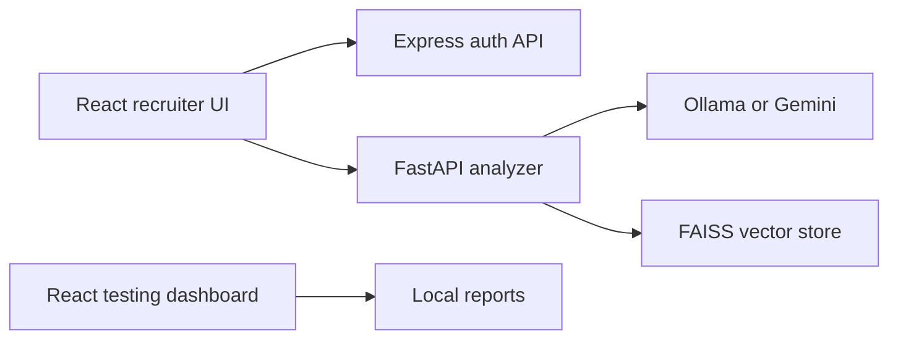

# Architecture Report

## Current Components

## Validation Focus

- Maintain a documented contract between the React UI, Express auth API, and FastAPI analyzer.
- Keep candidate data local unless a hosted provider is explicitly selected.
- Version vector-store metadata before modifying persisted structures.
- Use deterministic fallback behavior when an LLM provider is unavailable.
